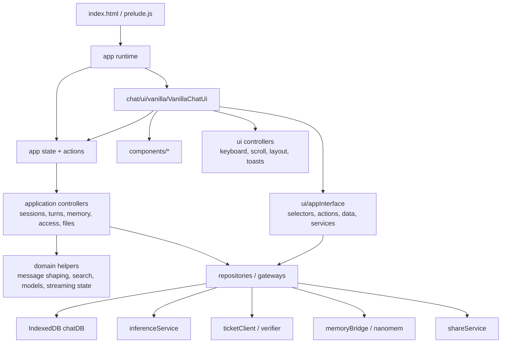

# Frontend Architecture Refactor

This document tracks the incremental refactor from the original browser-only
controller shape toward a framework-ready architecture. The current goal is to
preserve the vanilla DOM UI while separating domain/application logic from UI
rendering and backend/persistence services.

## Target Shape

## Boundaries

- `chat/domain/` must stay pure and browser-safe. It should not import DOM,
  IndexedDB, network, ticketing, verifier, or component modules.
- `chat/application/` should own use-case orchestration such as sending a turn,
  switching sessions, acquiring access, and memory approval. It may depend on
  repositories/gateways, but it should not manipulate DOM nodes.
- `chat/components/` and future framework adapters should consume narrow action
  and selector objects. They should not receive the full app controller once the
  compatibility facade is retired.
- `chat/app.js` must not import concrete files under `chat/components/`. The
  vanilla adapter owns concrete component construction; this is covered by an
  architecture test.
- Current shell components must use injected `app.data` and `app.services`
  ports for persistence and backend gateways. This keeps the vanilla DOM UI
  replaceable without making a new UI import IndexedDB, ticket, proxy, or
  inference modules directly.
- `chat/services/inference/`, `ticketClient`, `verifier`, and `memoryBridge`
  remain the privacy-sensitive backend seams. Do not bypass them from UI code.

## Current Progress

- 2026-05-06: First extraction slice landed.
  - Added `chat/domain/messageContent.js` for message text extraction and API
    payload shaping, including multimodal files, memory overrides, and image
    model output attachment.
  - Added `chat/domain/sessionSearch.js` for local titles, generated-title
    cleanup, and bounded conversation search indexing.
  - Added `chat/domain/streamingState.js` for pending phase normalization.
  - `chat/app.js` now delegates to those modules through compatibility methods,
    so existing components keep working while the tested seams are available for
    future controllers.
  - Added `npm test`, backed by `scripts/run-unit-tests.mjs`, which bundles
    browser-style ES modules with esbuild and runs Node's built-in test runner.
- 2026-05-06: Model-selection logic moved behind `chat/domain/modelSelection.js`.
  - The main controller now delegates disabled-model filtering, fallback-model
    choice, display-name alias normalization, and old-default preference upgrades.
  - Unit coverage locks the current alias and fallback behavior before future
    model-picker/controller work.
- 2026-05-06: Access acquisition moved behind `chat/application/accessController.js`.
  - The controller owns ticket-count checks, ticket redemption retry on spent
    tickets, verifier submit-key proof persistence, verifier rejection handling,
    `apiKeyShared` clearing, and final session persistence.
  - `ChatApp` supplies UI/logging callbacks, so right-panel updates and pending
    phase changes stay in the frontend layer while ticketing/verifier behavior is
    covered by mocked unit tests.
- 2026-05-10: First vanilla UI adapter seam added.
  - `chat/ui/appInterface.js` now builds component-specific interfaces for
    `ModelPicker` and `Sidebar`, exposing only the elements, state, selectors,
    and actions those components need.
  - `ModelPicker` no longer imports `chatDB` directly; model selection goes
    through an injected action. This is the intended pattern for future UI
    stacks: UI calls app actions, while persistence/functionality remains behind
    the app interface.
  - `Sidebar` now receives a sidebar-only facade instead of the full `ChatApp`
    instance, which makes replacing the sidebar UI less risky.
- 2026-05-10: Concrete component construction moved out of `chat/app.js`.
  - `chat/ui/vanilla/VanillaChatUi.js` is now the single owner of the current
    no-framework component tree.
  - `chat/app.js` imports the UI adapter, not individual components. A future UI
    rewrite can replace this adapter while keeping the same app/application
    interfaces.
  - Larger legacy components still use an explicit compatibility facade from
    `createComponentAppFacade(...)`; that facade is intentionally finite and
    tested so shrinking it is mechanical.
- 2026-05-10: Persistence and backend gateways moved behind UI ports for the
  shell.
  - `createComponentDataInterface(...)` now exposes the persistence operations
    needed by the vanilla shell: message/session reads and writes, settings,
    chat-history import transactions, and imported-session duplicate checks.
  - `ChatArea`, `ChatInput`, `MessageNavigation`, `RightPanel`,
    `MemoryEditor`, and `ChatHistoryImportModal` no longer import `chatDB`.
    They consume `app.data`, which means a framework UI can use mocked or
    alternative repositories without changing component behavior.
  - `createComponentServicesInterface(...)` groups backend-facing gateways
    (`tickets`, `networkLogger`, `networkProxy`, `inference`, `verifier`,
    `share`, `account`, `sync`) for UI injection.
    `RightPanel`, `WelcomePanel`, `ThanksPanel`, `ChatInput`, and
    `MemoryEditor` now call those injected services instead of importing the
    gateways directly.
  - Account and encrypted-sync HTTP calls share
    `services/sessionService.js`. Browser mode initializes the SuperTokens
    Session SDK locally with HttpOnly cookies; Electron mode delegates the same
    high-level operations to the isolated preload. See
    [Account Sessions](ACCOUNT_SESSIONS.md). Do not move session tokens into
    controller state or persistence adapters.
  - Architecture tests now enforce that `chat/app.js` does not import concrete
    components, domain/application layers do not import UI, shell components do
    not import `chatDB`, and gateway-heavy shell components do not import the
    ticket/proxy/inference/logger services directly.
- 2026-05-10: Remaining modal singleton gateway imports were folded into the
  same service port.
  - `TLSSecurityModal`, `VerifierAttestationModal`, `ShareModals`, and
    `AccountModal` now receive gateway services through configuration or
    `app.services` instead of importing network/proxy/verifier/share/account
    services directly.
  - `MessageTemplates` no longer reads `window.inferenceService` for welcome
    content; the vanilla adapter configures the template service provider.

## Next Slices

- Extract the duplicated streaming lifecycle in `sendMessage()` /
  `regenerateResponse()` into a `chatTurnController`.
- Continue shrinking the compatibility facade into component-specific
  contracts for `ChatArea`, `ChatInput`, `RightPanel`, and memory/import flows.
- Move global browser event wiring and cross-component lifecycle callbacks out
  of `chat/app.js` and into application/UI controllers so future framework
  adapters can own rendering without inheriting the legacy controller shape.
