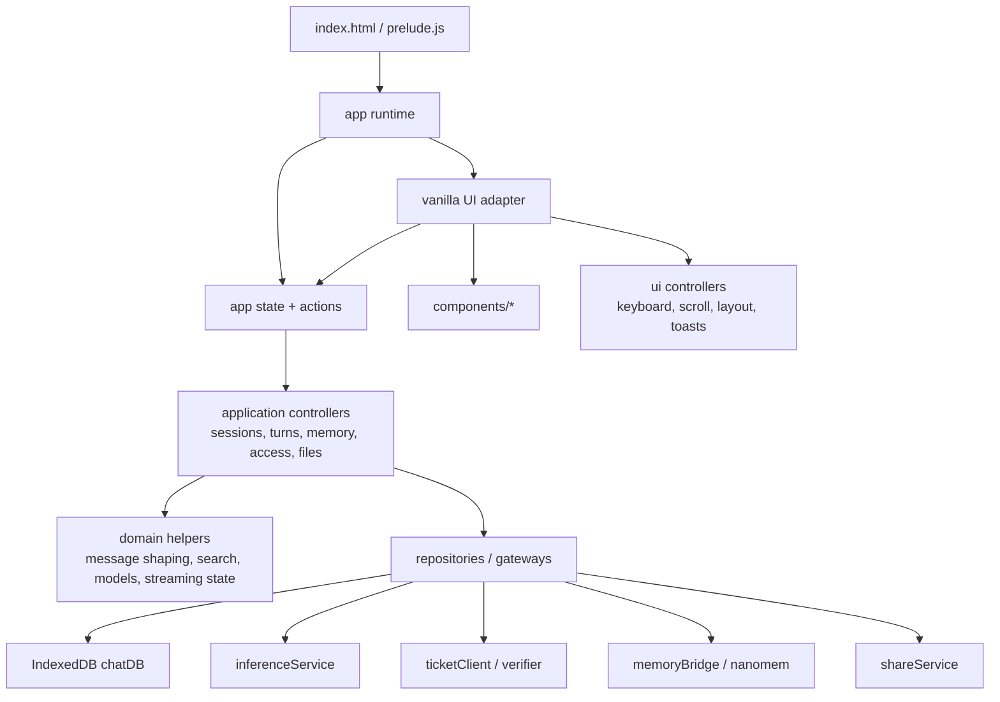

# Frontend Architecture Refactor

This document tracks the incremental refactor from the original browser-only
controller shape toward a framework-ready architecture. The current goal is to
preserve the vanilla DOM UI while separating domain/application logic from UI
rendering and backend/persistence services.

## Target Shape

## Boundaries

- `chat/domain/` must stay pure and browser-safe. It should not import DOM,
  IndexedDB, network, ticketing, verifier, or component modules.
- `chat/application/` should own use-case orchestration such as sending a turn,
  switching sessions, acquiring access, and memory approval. It may depend on
  repositories/gateways, but it should not manipulate DOM nodes.
- `chat/components/` and future framework adapters should consume narrow action
  and selector objects. They should not receive the full app controller once the
  compatibility facade is retired.
- `chat/services/inference/`, `ticketClient`, `verifier`, and `memoryBridge`
  remain the privacy-sensitive backend seams. Do not bypass them from UI code.

## Current Progress

- 2026-05-06: First extraction slice landed.
  - Added `chat/domain/messageContent.js` for message text extraction and API
    payload shaping, including multimodal files, memory overrides, and image
    model output attachment.
  - Added `chat/domain/sessionSearch.js` for local titles, generated-title
    cleanup, and bounded conversation search indexing.
  - Added `chat/domain/streamingState.js` for pending phase normalization.
  - `chat/app.js` now delegates to those modules through compatibility methods,
    so existing components keep working while the tested seams are available for
    future controllers.
  - Added `npm test`, backed by `scripts/run-unit-tests.mjs`, which bundles
    browser-style ES modules with esbuild and runs Node's built-in test runner.
- 2026-05-06: Model-selection logic moved behind `chat/domain/modelSelection.js`.
  - The main controller now delegates disabled-model filtering, fallback-model
    choice, display-name alias normalization, and old-default preference upgrades.
  - Unit coverage locks the current alias and fallback behavior before future
    model-picker/controller work.
- 2026-05-06: Access acquisition moved behind `chat/application/accessController.js`.
  - The controller owns ticket-count checks, ticket redemption retry on spent
    tickets, verifier submit-key proof persistence, verifier rejection handling,
    `apiKeyShared` clearing, and final session persistence.
  - `ChatApp` supplies UI/logging callbacks, so right-panel updates and pending
    phase changes stay in the frontend layer while ticketing/verifier behavior is
    covered by mocked unit tests.

## Next Slices

- Extract the duplicated streaming lifecycle in `sendMessage()` /
  `regenerateResponse()` into a `chatTurnController`.
- Start passing narrow action/selector objects to `ModelPicker` and `Sidebar`
  before tackling `ChatInput` and `ChatArea`, which have more UI state.
